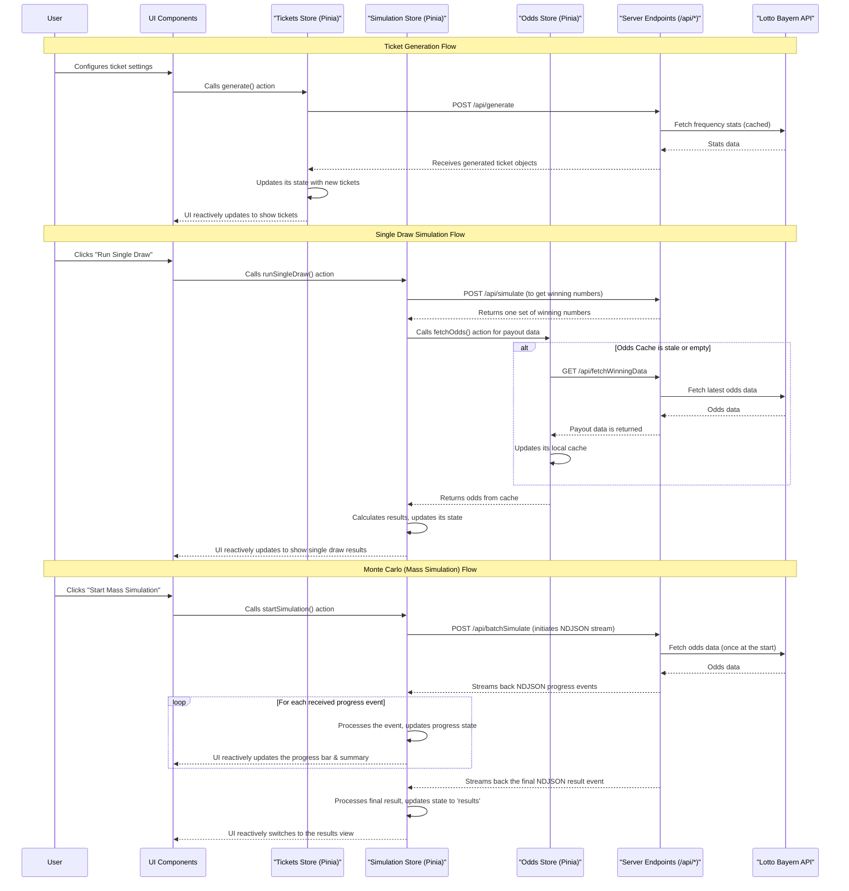

# Architecture – EuroJackpot Simulator

This document provides a high-level overview of the EuroJackpot Simulator application. Its purpose is to help an AI assistant understand the system's design for future development tasks.

**Core Technology:**

- **Framework:** Nuxt 4 (Vue 3) SPA
- **API:** Nitro serverless functions
- **Deployment:** Cloudflare Workers
- **External Data:** Lotto Bayern public API for odds and statistics.

---

## 1. System Overview

The application is a Single Page Application (SPA) with a serverless backend. A Pinia-based state management layer mediates all interactions between the UI components and the server, handling business logic, caching, and state synchronization.

For development guidelines and workflows, see [COMMON_GUIDE.md](./COMMON_GUIDE.md). For product requirements, see [PRD.md](./PRD.md).



---

## 2. Core Components & Logic

### Frontend (`app/`)

The frontend is responsible for the user interface and delegates all complex logic to the Pinia stores.

- **UI Components:**
  - `TicketGenerator.vue`: The main user interface for configuring tickets. It dispatches actions to the `TicketsStore`.
  - `SingleDrawPanel.vue` & `MonteCarloPanel.vue`: These components initiate simulations by calling actions on the `SimulationStore` and reactively display the state (progress, results, errors) managed by the store.

- **State Management (Pinia Stores):**
  - `stores/tickets.ts`: Manages the ticket generation lifecycle, holds the list of generated tickets, and syncs the URL state.
  - `stores/simulation.ts`: A state machine for both single draw and Monte Carlo simulations (`config` -> `running` -> `results`). It encapsulates all the logic for fetching data, processing streams, and calculating results.
  - `stores/odds.ts`: Caches winning odds from the `/api/fetchWinningData` endpoint to prevent redundant API calls.

- **Utilities (`app/utils/`):**
  - `combinatorics.ts`: Core logic for calculating line counts and determining win classes.
  - `batchStatistics.ts`: Client-side helpers for processing the final aggregated results from a Monte Carlo simulation.
  - `urlHash.ts`: Logic for encoding and decoding application state to/from the URL hash for persistence and sharing.

### Backend API (`server/api/`)

The backend provides four main serverless endpoints. All endpoints use **Zod** for strict input and output validation.

#### API Endpoints

- **`POST /api/generate`**: Generates unique lottery tickets (1-500 per request)
  - **Parameters**: System configuration, ticket count, generation method (uniform/weighted), optional seed
  - **Response**: Array of ticket objects with main and euro numbers
  - **Logic**: Uses either uniform random or weighted algorithm based on historical stats (cached for 10 minutes)

- **`GET /api/simulate`**: Single draw simulation
  - **Parameters**: Optional seed for deterministic results
  - **Response**: Single set of winning numbers (5 main + 2 euro)
  - **Logic**: Cryptographically secure RNG unless seed provided

- **`GET /api/fetchWinningData`**: Current win class payouts
  - **Response**: Normalised payout data for classes 1-12
  - **Reliability**: 8-second timeout with hardcoded fallback data

- **`POST /api/batchSimulate`**: Monte Carlo simulation engine (100-10,000 simulations)
  - **Parameters**: Tickets array, simulation count, batch size configuration
  - **Response**: NDJSON stream with progress events and final results
  - **Streaming**: Real-time progress via `application/x-ndjson` content type

#### API Logic Patterns

```pseudocode
// Ticket Generation
function generate(ticket_config):
  if ticket_config.method == "weighted" and not ticket_config.seed:
    stats = get_cached_statistics()
    return generate_weighted_tickets(stats)
  else:
    return generate_uniform_tickets() // Can be seeded

// Monte Carlo Simulation
function batchSimulate(tickets, simulation_count):
  odds_map = fetch_and_normalize_odds()
  stream = create_ndjson_stream()

  loop over simulation_count in batches:
    batch_results = run_simulations_for_chunk(...)
    progress_summary = aggregate(batch_results)
    stream.write({ type: "progress", data: progress_summary })

  final_result = calculate_final_statistics()
  stream.write({ type: "result", data: final_result })
  stream.close()
```

---

## 3. State Management Strategy (3-Layer Architecture)

The application follows a strict **3-layer state model** that enforces clear separation of concerns and ensures maintainability:

### Layer 1: URL Persistence (Configuration State)

- **PURPOSE**: Shareable, bookmarkable configuration that survives page refreshes.
- **WHEN TO USE**: User-defined simulation parameters (e.g., system type, number of tickets), reproducible seeds.
- **IMPLEMENTATION**: The `TicketsStore` decodes the URL hash on page load and encodes it back on any configuration change.
- **EXAMPLE**: `const config = { system: '7x3', tickets: 50, seed: 'LUCKY123' }` is synced to the URL hash `#system=7x3&tickets=50&seed=LUCKY123`.

### Layer 2: Pinia Domain Stores (Business Logic & Caching)

- **PURPOSE**: Managing complex state machines, business rules, API caching, and side effects.
- **WHEN TO USE**: Simulation lifecycle (`'config' → 'running' → 'results'`), caching API data (like winning odds), and implementing all core application logic.
- **IMPLEMENTATION**: Manages complex state that isn't part of the URL, such as the list of generated tickets, live simulation progress, final results, and cached API data.
- **EXAMPLE**: The `useSimulationStore` handles the entire process of starting a simulation, tracking its progress, and storing results or errors.

### Layer 3: SSR-Safe Ephemeral State (UI State)

- **PURPOSE**: Temporary, non-business UI state that must work with Server-Side Rendering (SSR).
- **WHEN TO USE**: Component-level loading indicators, modal visibility, temporary notifications, UI toggles.
- **IMPLEMENTATION**: `useState` is Nuxt's SSR-safe tool for simple, non-domain state.
- **EXAMPLE**: `const showWelcomeMessage = useState('welcome-visible', () => false)` for a temporary banner.

---

## 4. Key Design Principles

- **Reliability through Fallbacks:** The system is designed to be resilient. If an external API for odds or statistics fails, the application gracefully falls back to using cached or hardcoded data, ensuring core features remain functional.
- **Performance:** Long-running Monte Carlo simulations are offloaded to the server. The NDJSON stream prevents the UI from freezing and provides a responsive user experience with real-time progress.
- **Maintainability:**
  - **Centralized Constants:** All "magic numbers" (e.g., lottery number ranges, ticket limits) are stored in `app/utils/constants.ts`, providing a single source of truth.
  - **Strict Validation:** Zod schemas (`app/schemas/`) are used at all API boundaries to ensure data integrity.
  - **Separation of Concerns:** Business logic is kept in stores and utils, API logic on the server, and UI logic in Vue components.

---

## 5. Testing

The project uses **Vitest** with **happy-dom** for fast and reliable unit testing. The focus is on testing business logic, utilities, and server-side handlers rather than UI components.

- **Testing Strategy:**
  - **Utilities (`app/utils/`):** All critical logic, such as combinatorics, pricing, and RNGs, is thoroughly unit tested.
  - **Server Endpoints (`server/api/`):** API handlers are tested to ensure they correctly validate input, handle errors, and return data in the expected format.
  - **Pinia Stores (`stores/`):** The logic within store actions is tested to verify correct state transitions and side effects.

- **Running Tests:**

  ```bash
  # Run all tests once
  npm test

  # Run tests in watch mode for TDD
  npm test -- --watch
  ```

---

## 6. Development Environment

### Local Development Setup

```bash
# Install dependencies
npm install

# Start development server (localhost:3000)
npm run dev

# Build for production
npm run build

# Preview production build
npm run preview
```

### Environment Configuration

Optional environment variables:

- `NUXT_PUBLIC_API_BASE`: Base URL for API endpoints (default: `/api`)

### Code Quality Tools

- **ESLint**: Static code analysis and coding standards enforcement
- **Prettier**: Automatic code formatting with consistent styling
- **Husky + lint-staged**: Pre-commit hooks ensuring quality standards

### Essential Commands

```bash
npm test              # Run all tests
npm run test -- --watch  # Watch mode for TDD
npm run lint          # Check code quality
npm run format        # Format all code
npm run cf-typegen    # Generate Cloudflare Worker types
```

---

## 7. Deployment & Performance

### Deployment Architecture

**Target Platform**: Cloudflare Workers with Nitro serverless preset
**Build Process**: Nuxt generates optimised bundle for edge deployment
**CLI Tool**: Wrangler for deployment management

```bash
npm run deploy        # Deploy to Cloudflare Workers
```

### Performance Targets

- **API Latency**: P95 < 1500ms for all endpoints
- **Error Rate**: < 0.1% with graceful fallbacks
- **Streaming**: Real-time Monte Carlo progress via NDJSON
- **Caching**: 10-minute cache for external data sources
- **Edge Distribution**: Global deployment for optimal performance

### Reliability Features

- **Graceful Fallbacks**: External API failures handled with cached/hardcoded data
- **Timeout Management**: 8-second timeout for external data fetching
- **Data Validation**: Comprehensive Zod schemas at all API boundaries
- **Error Boundaries**: Robust error handling throughout the application stack
