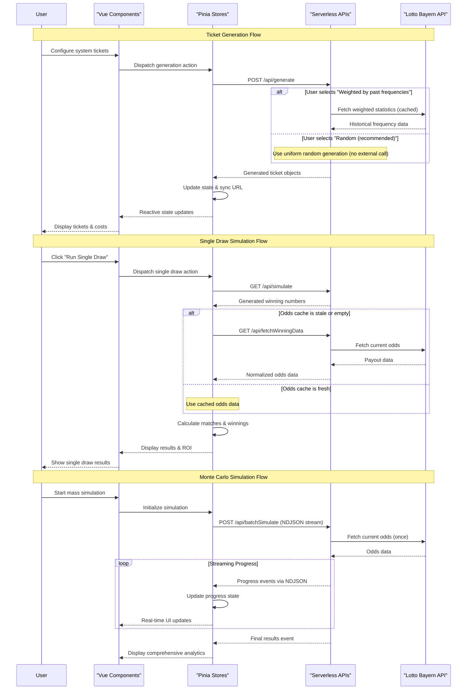

# EuroJackpot Simulator - Architecture Guide

This document provides architectural guidance for LLMs working with the EuroJackpot Simulator codebase. It focuses on system design patterns, architectural decisions, and medium-level implementation strategies that enable effective code contributions.

**System Context**: Educational lottery simulation SPA with serverless backend, deployed on Cloudflare Workers, emphasizing reliability and real-time streaming capabilities.

---

## System Overview

The application implements a **3-tier serverless architecture** with clear separation between presentation, business logic, and data persistence layers:

**Frontend**: Nuxt 4 SPA with Vue 3 Composition API, handling user interaction and real-time updates
**Backend**: Nitro serverless functions providing validated APIs with streaming capabilities  
**External Integration**: Lotto Bayern API with intelligent caching and fallback strategies



---

## Architecture Patterns

### 3-Layer State Management (Critical Pattern)

The application enforces strict **state layer separation** to maintain clarity and prevent architectural drift:

**Layer 1: URL Persistence (Configuration State)**

- **Purpose**: Shareable, bookmarkable configurations surviving page refreshes
- **Scope**: User simulation parameters, system settings, reproducible seeds
- **Implementation**: Hash-based URL synchronization via `urlHash.ts` utility
- **Example**: `#system=7x3&tickets=50&seed=LUCKY123` enables exact reproduction

**Layer 2: Pinia Domain Stores (Business Logic & Caching)**

- **Purpose**: Complex business logic, API orchestration, and application state management
- **Scope**: Simulation lifecycle management, data caching, async operations, mode state management
- **Implementation**: Domain-specific stores (`tickets`, `simulation`, `odds`) with mode-aware state
- **Application State Flow**: Mode selection (`simple`/`custom`) → Ticket configuration → Generation → Simulation lifecycle (`config` → `running` → `results`)
- **Mode Management**: Simple mode auto-triggers single draw, custom mode provides full control

**Layer 3: SSR-Safe Ephemeral State (UI State)**

- **Purpose**: Temporary UI state compatible with server-side rendering
- **Scope**: Loading indicators, modal visibility, transient notifications
- **Implementation**: Nuxt's `useState` composables for SSR safety
- **Constraint**: Must work identically on server and client rendering

### Component Architecture Pattern (CRITICAL: "Dumb" UI Principle)

**ABSOLUTE RULE**: Vue components are **"dumb"** presentation layers that NEVER contain business logic or call APIs directly.

**Component-Store Interaction Flow**:

```
User Interaction → Component Event → Store Action → API Call → Store State Update → Component Reactive Update
```

**✅ CORRECT Component Pattern**:

```typescript
// Components ONLY dispatch actions and consume reactive state
const simulationStore = useSimulationStore()
const { startSimulation, cancelSimulation } = simulationStore
const { progress, isRunning, results } = storeToRefs(simulationStore)

const handleStartClick = () => {
  // Component ONLY triggers store action - NO business logic
  startSimulation()
}
```

**❌ FORBIDDEN Component Anti-Patterns**:

```typescript
// NEVER: Direct API calls from components
const response = await fetch('/api/simulate')

// NEVER: Business logic in components
const calculateROI = (winnings: number, cost: number) => {
  return ((winnings - cost) / cost) * 100
}

// NEVER: Complex state management in components
const [tickets, setTickets] = useState([])
const [isLoading, setIsLoading] = useState(false)
```

**Strict Responsibility Boundaries**:

- **UI Components**: Event handling, reactive rendering, user feedback **ONLY**
- **Pinia Stores**: **ALL** business logic, **ALL** API calls, **ALL** complex state management
- **Utilities**: Pure functions, calculations, data transformations (called by stores, not components)

### API Design Patterns

**Validation-First Design**: Every endpoint uses **Zod schemas** for comprehensive input/output validation, preventing runtime errors and ensuring type safety across the stack.

**Progressive Enhancement**: APIs designed with fallback strategies enabling graceful degradation when external dependencies fail.

```pseudocode
// Standard API Pattern
function apiEndpoint(request):
  // 1. Validate input with Zod schema
  validated_input = InputSchema.parse(request.body)

  // 2. Execute business logic with error handling
  try:
    result = performBusinessLogic(validated_input)
  catch external_api_error:
    result = fallbackStrategy(validated_input)

  // 3. Validate and return response
  return ResponseSchema.parse(result)
```

### Store-Component Interaction Patterns

**Fundamental Principle**: Components are **reactive consumers** of store state and **action dispatchers** to stores. They NEVER perform business operations directly.

**Store State Consumption Pattern**:

```typescript
// ✅ CORRECT: Components reactively consume store state
const simulationStore = useSimulationStore()
const ticketsStore = useTicketsStore()

// Destructure reactive state (automatically updates component)
const { progress, isRunning, error } = storeToRefs(simulationStore)
const { tickets, totalCost } = storeToRefs(ticketsStore)
```

**Store Action Dispatch Pattern**:

```typescript
// ✅ CORRECT: Components only trigger store actions
const handleGenerateTickets = (config) => {
  // Component passes data to store action - store handles the rest
  ticketsStore.generateTickets(config)
}

const handleStartSimulation = () => {
  // Store handles ALL logic: API calls, state updates, error handling
  simulationStore.startMonteCarlo()
}
```

**Critical Architecture Flow**:

1. **User Interaction** → Component captures event
1. **Component Action** → Dispatches to appropriate store action
1. **Store Logic** → Handles ALL business logic and API calls
1. **Store State Update** → Updates internal state
1. **Component Reactivity** → Component automatically re-renders based on store state changes

**What Components Should NEVER Do**:

- Make HTTP requests or API calls
- Perform calculations or data transformations
- Manage complex state beyond simple UI state
- Contain business logic or validation rules
- Directly manipulate data structures

### Overlay UI Pattern

**Design Principle**: Centralized modal overlay architecture eliminates code duplication and ensures consistent user experience across all customization interfaces.

**Implementation**: The `CustomizationOverlay` component provides a single, comprehensive modal interface that can be accessed from both the initial hero section and results screen. This pattern:

- **Eliminates Duplication**: Replaces 270+ lines of duplicate form code with a single overlay component
- **Ensures Consistency**: Identical customization experience regardless of entry point
- **Maintains Accessibility**: Full keyboard navigation, backdrop blur, and click-outside-to-close functionality
- **Follows Architecture**: Overlay remains a "dumb" UI component, dispatching all actions to `TicketsStore`

---

## System Components

### Frontend Architecture

**State-Driven UI**: All components react to Pinia store state changes, creating predictable data flow and simplifying debugging.

**Key Components**:

- **HeroSection**: Entry point component providing simple mode quick-start with interactive stepper and progressive disclosure to custom mode
- **TicketGenerator**: Orchestrates ticket configuration and generation through `TicketsStore` with dual-mode support
- **CustomizationOverlay**: Centralized modal overlay for all customization interfaces, providing consistent user experience across both first screen and results screen
- **FavoriteNumbersSelector**: Visual interface for custom number selection with add/remove functionality
- **UnpopularityDisplay**: Educational component explaining unpopular combination factors and cognitive biases
- **FrequencyDisplay**: Comprehensive frequency visualization with bar charts and statistical analysis
- **TicketItem**: Individual ticket display with deletion capability and visual highlight support
- **SimulationPanels**: Handle single-draw and Monte Carlo simulation UIs via `SimulationStore`
- **Progress Components**: Real-time NDJSON stream visualization with cancellation support

**Utility Organization**:

- **Constants Management**: All numeric bounds centralized in `app/utils/constants.ts` including simple mode configuration
- **Scroll Utilities**: Smooth navigation utilities in `app/utils/scrollUtils.ts` for mode transitions
- **Pure Functions**: Mathematical calculations, data transformations in dedicated utilities
- **Type Safety**: Comprehensive TypeScript coverage with Zod schema integration

### Backend Architecture

**Serverless Function Design**: Each endpoint is a self-contained function optimized for Cloudflare Workers edge deployment.

**API Endpoints & Responsibilities**:

**`POST /api/generate`**: Ticket generation with multiple algorithms

- Validates system configuration and ticket parameters
- Implements Efraimidis-Spirakis algorithm for weighted sampling
- Supports unpopular combination generation using Monte Carlo candidate selection
- Caches historical statistics for 10 minutes
- Supports deterministic generation via optional seeding

**`GET /api/simulate`**: Single draw number generation

- Cryptographically secure randomness by default
- Optional seeding for reproducible testing
- Immediate response for interactive user experience

**`POST /api/batchSimulate`**: Monte Carlo simulation engine

- Processes 100-10,000 simulations with configurable batching
- Streams real-time progress via NDJSON format
- Implements cancellation and comprehensive error handling
- Generates detailed statistical analysis in final response

**`GET /api/fetchWinningData`**: External API proxy with resilience

- Normalizes Lotto Bayern API responses (classes 101-112 → 1-12)
- 8-second timeout with hardcoded fallback data
- Handles API inconsistencies and network failures gracefully

**`GET /api/frequencies`**: Historical frequency analysis endpoint

- Provides comprehensive frequency data for all 62 numbers (50 main + 12 Euro)
- Reuses existing statistics caching infrastructure (10-minute expiration)
- Returns structured data with color-coded tier analysis
- Supports visual frequency display and informed number selection

### Number Generation Algorithms

The application supports four distinct number generation methods, each serving different educational and strategic purposes:

**1. Uniform Random (Default)**

- Pure Fisher-Yates shuffle for unbiased selection
- Cryptographically secure randomness
- No external data dependencies

**2. Weighted by Historical Frequencies**

- Efraimidis-Spirakis algorithm for weighted sampling without replacement
- Uses square root transformation to smooth probability distributions
- Caches Lotto Bayern API data for 10 minutes

**3. Favorite Numbers Enhanced**

- Hybrid approach combining user preferences with statistical weighting
- Applies 2.5x multiplier to favorite numbers in weighted sampling
- Falls back to pure favorite + random filling when statistics unavailable

**4. Unpopular Combinations (Monte Carlo)**

- Generates 100 random candidates and selects least popular combination
- Uses sophisticated popularity scoring based on cognitive bias research:
  - **Birthday Bias**: Numbers 1-31 (dates) over-selected by humans
  - **Lucky Numbers**: Culturally significant numbers (3, 7, 11, 13, 17, 21)
  - **Arithmetic Sequences**: Consecutive or evenly spaced patterns
  - **Visual Patterns**: Same last digit or decade clustering
  - **Tight Spread**: Numbers bunched together
  - **Euro Month Effect**: Euro numbers resembling month pairs
- Aims to minimize prize sharing by avoiding commonly chosen patterns
- Provides educational explanations of detected bias patterns

**Technical Implementation Details**:

- All algorithms maintain deterministic seeding for testing reproducibility
- Popularity scoring uses tanh function for bounded [0.25, 1.75] multiplier range
- Unpopular generation validates standard EuroJackpot format (5+2) only
- Comprehensive test coverage ensures algorithm correctness and stability

### External Integrations

**Lotto Bayern API Integration**:

- **Purpose**: Fetch current win-class payouts and historical number frequencies
- **Reliability Strategy**: Timeout + fallback ensures application never fails due to external dependencies
- **Caching Strategy**: 10-minute cache prevents excessive API calls while maintaining reasonable freshness
- **Data Normalization**: Converts external class numbering to consistent internal format

---

## Data Flow & Interactions

### Ticket Generation Flow

**Simple Mode Flow**:

1. **One-Click Start**: User clicks "Generate Random Tickets" in HeroSection
1. **Auto-Configuration**: System applies simple mode defaults (10 tickets, 5+2 format, random method)
1. **Generation**: Server generates tickets using uniform random algorithm
1. **Auto-Simulation**: System automatically triggers single draw simulation
1. **Results Display**: Immediate feedback with matches highlighted and ROI calculated

**Custom Mode Flow**:

1. **Mode Transition**: User switches from simple to custom mode via "Customize" button
1. **User Configuration**: Component captures system parameters (main/euro numbers) and optional favorite numbers
1. **Validation**: Zod schemas validate parameters including favorite number constraints before API call
1. **Generation**: Server applies uniform, weighted, favorite-enhanced, or unpopular algorithms based on configuration
1. **State Update**: Store receives tickets, updates URL persistence including favorite numbers, triggers UI refresh
1. **Cost Calculation**: Real-time price computation using official €2.00/line pricing
1. **Individual Management**: Users can delete specific tickets with automatic state recalculation

### Simulation Execution Flow

**Single Draw**: Immediate feedback loop for quick experimentation

- Generate winning numbers → Compare against tickets → Calculate payouts → Display ROI

**Monte Carlo**: Streaming architecture for long-running operations

- Initialize progress tracking → Stream batch results → Aggregate statistics → Final analytics

### State Synchronization Patterns

**URL ↔ Store Synchronization**: Bidirectional sync ensures configuration persistence including favorite numbers
**Store ↔ Component Reactivity**: Vue's reactive system propagates state changes automatically
**API ↔ Store Integration**: Async actions handle loading states and error boundaries
**Frequency Data Management**: Auto-fetching and caching of historical frequency data for visual analysis
**Deletion State Handling**: Automatic cleanup and recalculation when individual tickets are removed

---

## Quality & Reliability

### Error Handling Architecture

**Layered Error Boundaries**: Each architectural layer implements appropriate error handling strategies:

- **API Layer**: Input validation, timeout handling, fallback responses
- **Store Layer**: Loading states, error state management, retry logic, state cleanup on ticket deletion
- **Component Layer**: User-friendly error messages, recovery actions, accordion UI patterns

### Performance Strategies

**Streaming Architecture**: NDJSON streaming prevents UI blocking during long simulations
**Edge Deployment**: Cloudflare Workers global distribution minimizes latency
**Intelligent Caching**: Strategic caching of external data balances freshness with performance
**Batch Processing**: Server-side batching prevents event loop blocking

### Testing Architecture

**Business Logic Focus**: Testing strategy prioritizes logic over presentation:

- **Pinia Stores**: State transitions, async actions, error handling
- **Utilities**: Mathematical functions, data transformations, edge cases
- **API Endpoints**: Request/response validation, business logic, error scenarios
- **Not Tested**: Vue component rendering, CSS styling, trivial event handlers

---

## Development Patterns

### Code Organization Principles

**Domain-Driven Structure**: Code organized by business domain rather than technical layer
**Dependency Direction**: Dependencies flow inward (UI → Stores → Utilities)  
**Single Responsibility**: Each module, store, and component has a clear, focused purpose

### Validation Strategies

**Schema-Driven Development**: Zod schemas define data contracts throughout the system
**Runtime Validation**: All external data boundaries protected by validation
**Type Derivation**: TypeScript types derived from Zod schemas ensure consistency

### State Management Best Practices

**Store Composition**: Each store handles a specific domain with clear boundaries
**Action Patterns**: Async actions handle loading states and error conditions consistently
**Computed Properties**: Derived state computed reactively rather than stored redundantly

---

## Deployment Architecture

### Platform Constraints

**Cloudflare Workers Limitations**:

- 30-second execution time limit (addressed via streaming for long operations)
- Memory constraints (handled through batch processing)
- Cold start considerations (minimized through optimization)

**Edge Computing Benefits**:

- Global distribution for optimal user experience
- Automatic scaling based on demand
- Integrated CDN for static asset delivery

### Deployment Patterns

**Serverless-First Design**: Application architected specifically for serverless deployment
**Environment Agnostic**: Minimal environment configuration required
**Atomic Deployments**: Single deployment unit prevents configuration drift

**Performance Targets**:

- P95 API latency < 1500ms across all endpoints
- Error rate < 0.1% with comprehensive fallback coverage
- Real-time streaming responsiveness for simulations up to 10,000 iterations

---

## Related Documentation

- **[Product Requirements](./PRD.md)** - Business context and feature specifications
- **[Development Guide](./COMMON_GUIDE.md)** - Setup instructions, testing commands, and development workflows
