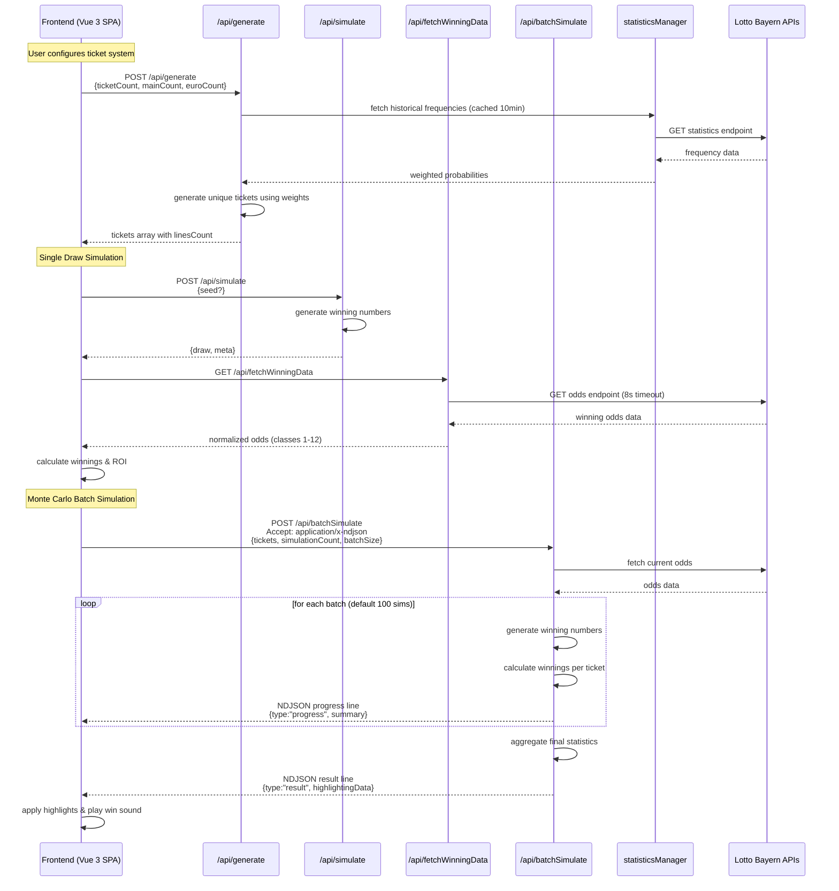
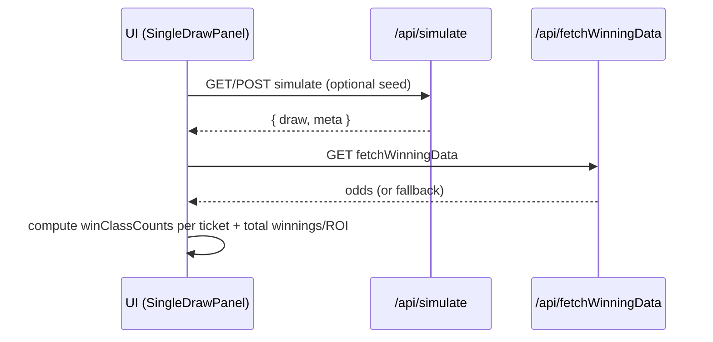
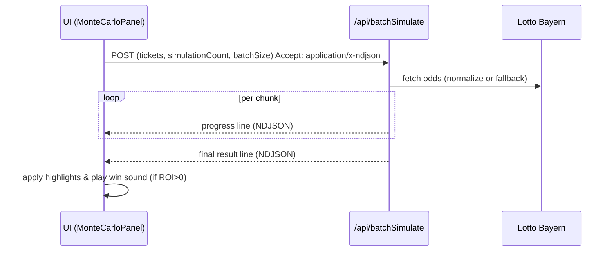
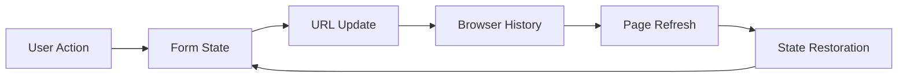
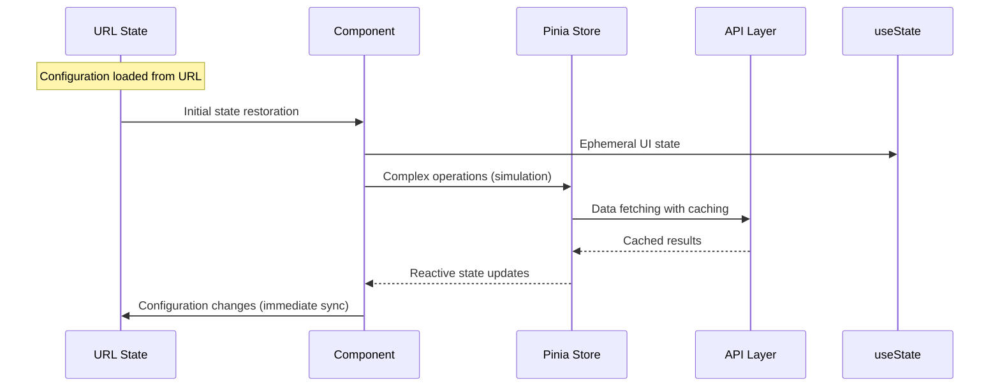

# Architecture – EuroJackpot Simulator

> Runtime: **Nuxt 4 + Vue 3 SPA** on the edge with a **Nitro** serverless API deployed to **Cloudflare Workers**.  
> External data: **Lotto Bayern** public endpoints (odds + statistics).  
> Purpose: Educational simulator for EuroJackpot system tickets (5/50 + 2/12), single-draw and Monte Carlo.

---

## 1) System Overview



- **Frontend (FE)**: SPA renders Ticket generator, Single Draw, and Monte Carlo panels.
- **API**: `/api/generate`, `/api/simulate`, `/api/fetchWinningData`, `/api/batchSimulate` (supports **NDJSON streaming**).
- **External**: Lotto Bayern endpoints for odds + frequency stats (with **normalization & fallbacks**).

---

## 2) Key Components

### Frontend (app/)

- **Components**
  - `TicketGenerator.vue`: Configures ticket systems and quantity; shows total cost; orchestrates Single Draw & Monte Carlo panels.
  - `SingleDrawPanel.vue`: Calls `/api/simulate` + `/api/fetchWinningData`, highlights matches, computes winnings/ROI, plays a short **Web Audio API** “win” tone.
  - `MonteCarloPanel.vue`: Runs `/api/batchSimulate` with **NDJSON** progress; renders `BatchSimulationProgress.vue` and `BatchSimulationResults.vue`; applies result-driven ticket highlights.
  - Visuals: `TicketNumber.vue` and `TicketNumber3DSimple.vue` (canvas-based 3D badges).

- **Utilities**
  - `numberGenerator.ts`: Weighted-with-fallback number generation. Uses Efraimidis–Spirakis-style keys (`log(u)/w`) over **sqrt(weight)** to gently de-emphasize outliers. Falls back to crypto-backed uniform.
  - `rng.ts`: Crypto-backed RNG where available.
  - `combinatorics.ts`: `nCr`, cartesian expansion, and **win class** line-count math for system tickets.
  - `winningClasses.ts`: Maps (matched main, matched euro) → win class (1–12).
  - `payout.ts`: Builds class→amount map from odds payload.
  - `odds.ts`: Normalizes Lotto Bayern classes **101–112 → 1–12**.
  - `statisticsManager.ts`: Fetches frequency statistics with **10-minute cache**; returns `null` on invalid/failed fetch (triggers uniform fallback).
  - `batchStatistics.ts`: Aggregates batch results (ROI, EV, percentiles, win distribution), simulates a single draw over system tickets, and provides **theoretical EV calculation** for accurate break-even analysis.
  - `ticketHighlighting.ts`: **Centralized logic** for ticket highlight computation, eliminating duplication between Single Draw and Monte Carlo components.
  - `winClassColors.ts`: **Centralized color mapping** for win classes, ensuring consistent styling across components.
  - `constants.ts`: **Single source of truth** for all numeric bounds and validation limits used throughout the application.
  - `time.ts`: Friendly durations for progress UI.
  - `audioUtils.ts`: Short win tones based on profit ratio.

- **Styling**
  - Tailwind with custom “casino” palette (`tailwind.config.js`, `app/assets/css/tailwind.css`).

### API (server/api/)

- **`/api/generate` (POST)**
  **Consolidated endpoint** that validates input with **zod** and generates unique tickets server-side. Uses weighted stats when available (10-minute cache) and falls back to uniform. Adds `linesCount = C(m,5)×C(e,2)`. All ticket generation logic is unified in this single endpoint for maintainability. Seeds are accepted here for reproducibility and are not used on the client.
- **`/api/simulate` (GET/POST)**
  Draw generator:
  - If `seed` provided → deterministic via `server/utils/seededRng.ts` (sorted, unique).
  - Else uses uniform crypto-backed `generateRandomNumbers`.
  - Returns `{ draw: { mainNumbers, euroNumbers }, meta: { algorithm, seed?, generatedAt } }`.

- **`/api/fetchWinningData` (GET)**
  Fetches previous draw odds from Lotto Bayern (with **8s timeout**); validates via zod; **fallback odds** on error/invalid.
- **`/api/batchSimulate` (POST)**
  Runs N simulated draws:
  - Accepts `application/json` or **`application/x-ndjson`** for streaming progress.
  - For each chunk (default 100): generates winning numbers, tallies system-line wins per ticket, computes payouts via odds map, accumulates **highlightingData** for UI.
  - Final aggregates include totals, ROI, EV, percentiles, win distribution, and optional per-simulation results (guarded in UI for >1000).

### Validation & Error Handling (server/utils/)

- **`validation.ts`**
  - `validateInput/validateOutput/validateExternalResponse` (zod wrappers; consistent **4xx/5xx**).
  - `fetchWithTimeout` (defaults to 10s; returns 504 on abort).
  - `handleEndpointError` – converts thrown errors to h3 `createError` consistently.

- **`seededRng.ts`**
  Fast deterministic PRNG + unique sorted sampler.

### Code Quality & Maintainability

- **Centralized Constants (`app/utils/constants.ts`)**
  - Single source of truth for all numeric bounds: lottery ranges (1-50, 1-12), system limits (5-16, 2-12), ticket counts (1-500), simulation limits (100-10,000)
  - All Zod schemas import from constants instead of hardcoding values
  - Ensures consistency and easier maintenance of validation rules

- **Consolidated Validation Patterns**
  - Single validation boundary at API routes using Zod schemas
  - Statistics validation uses shared `statisticsDataSchema` instead of custom type guards
  - Minimal internal assertions, comprehensive boundary validation

- **DRY Principle Implementation**
  - Shared ticket highlighting logic in `buildTicketHighlightUpdate()`
  - Centralized win class color mapping in `getWinClassColor()`
  - Unified ticket generation endpoint eliminating code duplication
  - **EV-based break-even calculation** replacing hardcoded averages with `calculateTheoreticalExpectedValue()`

---

## 3) Data Flow

### Single Draw (seeded or random)



### Monte Carlo (NDJSON streaming)



---

## 4) Domain Rules & Calculations

- **System ticket lines**: `C(m,5) * C(e,2)`; **€2.00/line** (see `pricing.ts`).
- **Win classes**: 1–12 per `(matched main, matched euro)` (mapping in `winningClasses.ts`).
- **Batch simulation**: for each ticket, compute **count of winning lines by class** via combinatorics; payout = Σ(count × class amount).
- **Break-even calculation**: Uses **theoretical Expected Value** via `calculateTheoreticalExpectedValue()` with current odds and ticket system parameters, replacing hardcoded averages for mathematical accuracy.
- **Odds normalization**: Some external responses encode classes as `101–112`; app normalizes to `1–12`.

---

## 5) Reliability & Fallbacks

- **Statistics**: 10-minute cache; if unavailable/invalid → **uniform** number generation.
- **Odds**: External failures/invalid → **fallback odds** (both `/fetchWinningData` and `/batchSimulate`).
- **Timeouts**: 8s on winning data endpoint fetch; 10s default in util.
- **Streaming**: NDJSON keeps UI responsive for large N.

---

## 6) Performance

- **Targets (PRD)**: P95 API latency < 1.5s for `/generate` and `/simulate`.
- **Batch**: Chunked processing (default 100) to bound memory & enable progress.
- **Crypto RNG**: Uses `crypto.getRandomValues` when available; otherwise `Math.random` fallback.

---

## 7) Security & Data

- No accounts/PII; no server-side persistence.
- External requests are read-only public endpoints.
- Client exports JSON only on user action.

---

## 8) Testing

- **Vitest + happy-dom**.
  Coverage:
  - RNG determinism/distribution, seeded sampling.
  - Combinatorics, pricing, time formatting.
  - Odds normalization, payout map.
  - Batch stats aggregation and EV calculation.
  - API route validation and Accept header behavior.

---

## 9) Deployment

- **Cloudflare Workers** via Nitro.
- Commands: `npm run dev/build/preview/deploy`.
- Ensure `public.apiBase` is configured (Nuxt runtime config) for FE→API calls.

---

## 10) Logging & Observability

- Location: `app/utils/logger.ts` (universal, auto-imported utility)
- Config sources:
  - Server: `useRuntimeConfig().logLevel` → `process.env.LOG_LEVEL` fallback
  - Client: `useRuntimeConfig().public.logLevel` → `process.env.NUXT_PUBLIC_LOG_LEVEL` fallback
  - Defaults: `'info'` in production, `'debug'` otherwise
- Levels: `'debug' | 'info' | 'warn' | 'error'` with priority in `app/utils/constants.ts`
- Behavior:
  - Debug logs are suppressed in production builds for zero-cost traces
  - Other levels are filtered by configured level (e.g., `LOG_LEVEL=warn` shows warn/error)
  - Structured prefix `[ISO_TIMESTAMP] [LEVEL]` for easier Workers observability
- Usage:
  - Import and use: `import { logger } from '~/utils/logger'`
  - Replace all `console.*` with `logger.debug|info|warn|error`
  - For expensive debug formatting, guard with `isLogLevelEnabled('debug')`
  - Do not log PII; keep payloads compact and structured
- Environment:
  - Nuxt runtime configuration set in `nuxt.config.ts`
  - Cloudflare deployment variables set in `wrangler.toml`:
    - `[vars]` defaults `LOG_LEVEL="info"`, `NUXT_PUBLIC_LOG_LEVEL="info"`
    - `[env.preview.vars]` sets both to `"debug"`
    - `[env.production.vars]` sets both to `"info"`
- Validation:
  - Unit tests in `app/utils/__tests__/logger.test.ts` verify level filtering and production debug suppression
  - Production builds should not contain debug strings; verify by scanning `dist` bundles

---

## 11) State Management & URL Persistence

### Configuration Persistence

- **Immediate URL Sync**: All form configuration automatically persisted to URL
- **Zero State Loss**: Page refresh never loses user configuration work
- **Unified Format**: Single URL structure handles both state persistence and sharing
- **Optional Reproducibility**: Shareable links include seed for exact reproduction

### URL Structure

- **State Persistence**: Parameters reflect current form configuration
- **Shared Reproduction**: Additional seed parameter enables exact ticket reproduction
- **Clean Entry Points**: Fresh visitors see clean URLs for SEO optimization
- No legacy URL upgrade: only the current unified format is supported

### Randomness Quality

- **Default Unseeded**: Most generations use true randomness for better distribution
- **Seeded When Shared**: Reproducible generation only when explicitly sharing
- **Optimal Distribution**: Eliminates forced seeding with potentially clustered values

## 11) State Management Architecture

The application implements a **3-layer state management system** combining URL-based persistence, Pinia domain stores, and SSR-safe ephemeral state.

### Layer 1: URL-Based State (Source of Truth)

**Purpose:** Canonical state for shareable configuration
**Location:** `app/utils/urlHash.ts`, `app/schemas/urlConfig.ts`



**Features:**

- **Immediate persistence:** Zero state loss on page refresh
- **Zod validation:** Type-safe URL parsing with schema validation
- **Smart sharing:** Unified format for persistence and reproduction

**Key Functions:**

- `parseUrlHash()`: Parses the current unified URL format
- `validateAppConfig()`: Zod-based configuration validation
- `updateBrowserUrl()`: Immediate URL synchronisation

### Layer 2: Pinia Domain Stores (Complex State)

**Purpose:** Centralised management for complex, cacheable domain state
**Location:** `stores/`

#### Simulation Store (`stores/simulation.ts`)

Manages Monte Carlo simulation lifecycle and complex state machine:

```typescript
type SimulationPhase = 'config' | 'running' | 'results' | 'cancelled' | 'error'

interface SimulationState {
  phase: SimulationPhase
  config: SimulationConfig | null
  progress: SimulationProgress | null
  results: BatchSimulationResult | null
  abortController: AbortController | null
}
```

**Capabilities:**

- **NDJSON streaming:** Real-time progress updates
- **Abort handling:** Cancellable long-running operations
- **Error recovery:** Comprehensive error state management
- **Result caching:** Persistent simulation results

#### Odds Store (`stores/odds.ts`)

Manages cached payout data with intelligent fallbacks:

```typescript
interface OddsCache {
  data: EurojackpotHistoricOdds | null
  timestamp: number
  isLoading: boolean
  error: string | null
}
```

**Capabilities:**

- **10-minute cache:** Matches server-side cache duration
- **Fallback odds:** Graceful degradation when API unavailable
- **Request deduplication:** Prevents multiple concurrent API calls
- **Cache statistics:** Monitoring and debugging support

### Layer 3: SSR-Safe Ephemeral State (useState)

**Purpose:** Temporary UI state that must be SSR-compatible
**Location:** `app/composables/useAppState.ts`

#### Audio State (`useAudioState`)

```typescript
const audioEnabled = useState('audio-enabled', () => true)
const winSoundLevel = useState<'none' | 'low' | 'medium' | 'high'>(
  'win-sound-level',
  () => 'medium'
)
```

#### Transient Errors (`useTransientErrors`)

```typescript
const errors = useState<string[]>('transient-errors', () => [])
// Auto-clearing errors with configurable duration
```

#### UI State (`useUIState`)

```typescript
const showGenerationForm = useState('show-generation-form', () => false)
const showWelcomeMessage = useState('show-welcome-message', () => false)
// Other ephemeral UI toggles
```

### State Flow Architecture



### State Persistence Strategy

| State Type          | Persistence       | Scope             | Example                          |
| ------------------- | ----------------- | ----------------- | -------------------------------- |
| **Configuration**   | URL Hash          | Global, Shareable | Ticket type, count, method       |
| **Domain Data**     | Pinia (Memory)    | Session           | Simulation results, cached odds  |
| **Ephemeral UI**    | useState (Memory) | Request/SSR       | Loading states, error messages   |
| **Component Local** | ref/reactive      | Component         | Form validation, temporary flags |

### Benefits of 3-Layer Architecture

1. **Performance:** Reduced API calls through intelligent caching
2. **User Experience:** Zero configuration loss on page refresh
3. **SSR Compatibility:** Future-ready for hybrid rendering
4. **Type Safety:** Zod validation throughout state layers
5. **Maintainability:** Clear separation of concerns
6. **Testability:** Isolated state layers for unit testing

### Migration Strategy

Legacy URL formats are no longer supported. All links must use the unified format documented above.

## 13) Cross-Component State Coordination Patterns

This section documents established patterns for managing state changes across components, particularly for UI actions that should trigger simulation resets or other cross-component side effects.

### Problem Statement

Complex applications often need to coordinate state changes between components. For example, when a user generates new tickets in `TicketGenerator.vue`, the `MonteCarloPanel.vue` should reset its simulation state. The challenge is implementing this coordination while following the 3-layer state management architecture and avoiding:

- Scattered imperative reset flags
- Tight coupling between components
- Race conditions from reactive watchers
- Architecture violations (business logic in components)

### Solution: Semantic Action Pattern

The recommended approach uses **semantic actions** that encode business intent rather than imperative commands.

#### Pattern Structure

```typescript
// In Pinia store (Layer 2)
const generateTickets = (tickets: Ticket[]) => {
  console.log('SimulationStore: User generated new tickets')
  state.value.currentTickets = tickets

  // Business logic: Reset simulation when user generates new tickets
  if (shouldResetOnTicketChange()) {
    console.log(
      'SimulationStore: Resetting simulation for new user-generated tickets'
    )
    resetToConfig()
  }
}

const resetTickets = () => {
  console.log('SimulationStore: User reset tickets')
  state.value.currentTickets = []

  // Business logic: Always reset simulation when user explicitly resets
  resetToConfig()
}

const syncTickets = (tickets: Ticket[]) => {
  console.log('SimulationStore: Syncing tickets from component lifecycle')
  // Just update tickets without reset logic - this is for component sync
  state.value.currentTickets = tickets
}

const shouldResetOnTicketChange = (): boolean => {
  // Business rule: Reset simulation when user changes tickets and we have results/errors
  return state.value.phase === 'results' || state.value.phase === 'error'
}
```

#### Component Usage

```typescript
// In TicketGenerator.vue
watch(
  tickets,
  (newTickets, oldTickets) => {
    if (JSON.stringify(newTickets) !== JSON.stringify(oldTickets)) {
      // Use lifecycle sync action - no business side effects
      simulationStore.syncTickets(newTickets)
    }
  },
  { deep: true }
)

const generateTicketsHandler = async () => {
  // ... API call to generate tickets
  tickets.value = generatedTickets

  // Use semantic action for user-initiated generation
  simulationStore.generateTickets(generatedTickets)
}

const clearTickets = () => {
  tickets.value = []

  // Use semantic action for user-initiated reset
  simulationStore.resetTickets()
}
```

### Key Principles

#### 1. Semantic Intent Over Imperative Commands

**Bad (Imperative):**

```typescript
simulationStore.setTickets(tickets, shouldReset: boolean)
```

**Good (Semantic):**

```typescript
simulationStore.generateTickets(tickets) // User action
simulationStore.syncTickets(tickets) // Component lifecycle
simulationStore.resetTickets() // User reset action
```

#### 2. Business Logic in Stores, Not Components

**Bad:**

```typescript
// Component decides when to reset
const handleTicketChange = () => {
  if (hasResults && userTriggered) {
    simulationStore.reset()
  }
  simulationStore.setTickets(tickets)
}
```

**Good:**

```typescript
// Store encodes business rules
const generateTickets = (tickets) => {
  state.currentTickets = tickets
  if (shouldResetOnTicketChange()) {
    resetToConfig()
  }
}
```

#### 3. Distinguish User Actions from Lifecycle Events

- **User Actions** (generateTickets, resetTickets): May trigger business logic side effects
- **Lifecycle Events** (syncTickets): Update state without side effects

#### 4. Clear Action Naming

Action names should clearly indicate:

- **Who** initiated the action (user vs system)
- **What** the intent is (generate vs sync vs reset)
- **When** side effects should occur

### Implementation Steps

1. **Identify Cross-Component Dependencies**
   - Map which user actions should affect other components
   - Identify the business rules that govern these relationships

2. **Design Semantic Actions**
   - Create action names that reflect user intent
   - Separate user actions from component lifecycle events
   - Encode business logic in the store actions

3. **Update Components**
   - Replace imperative store calls with semantic actions
   - Use lifecycle actions (syncTickets) for reactive updates
   - Use intent actions (generateTickets, resetTickets) for user actions

4. **Test Cross-Component Behavior**
   - Verify user actions trigger appropriate side effects
   - Ensure lifecycle events don't cause unwanted resets
   - Test edge cases and race conditions

### Benefits

- **Maintainable**: Business logic centralized in stores
- **Testable**: Clear action boundaries enable focused testing
- **Scalable**: Pattern extends to new cross-component relationships
- **Debuggable**: Semantic action names make state changes traceable
- **Architecture-Compliant**: Follows 3-layer state management principles

### Common Pitfalls to Avoid

1. **Overloaded Actions**: Don't add boolean flags to control side effects
2. **Component Business Logic**: Keep cross-component rules in stores
3. **Reactive Watchers for User Actions**: Use explicit semantic actions instead
4. **Tight Coupling**: Components should call store actions, not other components directly

This pattern ensures that future UI changes requiring cross-component coordination can be implemented cleanly and consistently.

### Implementation Example: Single Draw Persistence

The Single Draw persistence implementation demonstrates a complete application of the semantic action pattern for cross-component coordination.

#### Problem Context

Single Draw results were not persisting across user interactions:

- Results disappeared when generating new tickets
- Results disappeared when resetting tickets
- Results disappeared when switching between Single Draw and Monte Carlo tabs
- All state was managed locally in `SingleDrawPanel.vue` with no coordination

#### Solution Architecture

**1. Extended Simulation Store State:**

```typescript
interface SimulationState {
  // Existing Monte Carlo state...

  // Added Single Draw state
  singleDraw: {
    phase: 'idle' | 'running' | 'results' | 'error'
    winningNumbers: { mainNumbers: number[]; euroNumbers: number[] } | null
    oddsData: EurojackpotHistoricOdds | null
    results: {
      totalWinnings: number
      netProfit: number
      roiPercentage: number
      timestamp: number
      ticketHighlights: Array<TicketHighlightUpdate>
    } | null
    error: string | null
  }
}
```

**2. Single Draw Semantic Actions:**

```typescript
// User-initiated actions
const runSingleDraw = async (totalPrice: number) => {
  // Handle API calls, state transitions, and business logic
  // Automatically manages: API calls, error handling, result calculation, win sound
}

const resetSingleDraw = () => {
  // Clear single draw state
}

// Business rule functions
const shouldResetSingleDrawOnTicketChange = (): boolean => {
  // Business rule: PRESERVE Single Draw results when tickets change
  // This enables users to compare different ticket configurations against the same draw
  // Re-highlight new tickets against preserved winning numbers for better UX
  // Only reset on explicit user reset action, not on ticket changes
  return false
}
```

**3. Updated Cross-Component Coordination:**

```typescript
const generateTickets = (tickets: Ticket[]) => {
  state.value.currentTickets = tickets

  // Reset Monte Carlo if needed
  if (shouldResetOnTicketChange()) {
    resetToConfig()
  }

  // Preserve Single Draw and re-highlight with new tickets (better UX)
  if (shouldResetSingleDrawOnTicketChange()) {
    resetSingleDraw()
  } else if (state.value.singleDraw.phase === 'results') {
    // Re-calculate highlights for new tickets using preserved winning numbers
    reHighlightSingleDrawResults()
  }
}

const resetTickets = () => {
  state.value.currentTickets = []

  // Reset both simulations
  resetToConfig() // Monte Carlo
  resetSingleDraw() // Single Draw
}
```

**4. Component Simplification:**

```typescript
// Before: 60+ lines of local state management and API calls
const simulateExtractionHandler = async () => {
  // Complex API orchestration, error handling, state management...
}

// After: Simple store action call
const simulateExtractionHandler = async () => {
  await simStore.runSingleDraw(props.totalPrice)

  // Emit to parent for highlighting
  if (simStore.state.singleDraw.results?.ticketHighlights) {
    emit('apply-highlights', simStore.state.singleDraw.results.ticketHighlights)
  }
}
```

#### Results Achieved

- **Persistence**: Single Draw results now persist across tab switches and component lifecycle
- **Coordination**: Proper reset behavior when generating/resetting tickets
- **Separation of Concerns**: Business logic centralized in store, UI concerns in component
- **Consistency**: Same semantic action pattern as Monte Carlo
- **Maintainability**: 70% reduction in component complexity
- **Testability**: Store actions can be unit tested independently

#### Key Design Decisions

1. **Same Store vs Separate Store**: Used same simulation store to leverage existing semantic actions and ensure consistent coordination
2. **State Persistence Level**: Memory-only persistence (no URL persistence for ephemeral Single Draw results)
3. **Action Granularity**: Single `runSingleDraw` action encapsulates entire workflow rather than separate actions for each API call
4. **Error Handling**: Centralized in store action rather than component
5. **Component Interface**: Maintained existing emit interface for parent component compatibility

This implementation serves as a reference for future features requiring similar cross-component coordination while following the established architectural patterns.

## 12) Open Items / Future

- Optional toggle: **uniform vs weighted** generation in UI.
- Basic telemetry/analytics (not in code yet).
- i18n/currency options.

````

---

Addendum – Clarifications

- Odds normalization: Performed in `app/schemas/winning.ts` using Zod preprocess (`101–112 → 1–12`); no separate `odds.ts` normalizer exists in this repo.
- Statistics manager location: Frequency data cache is implemented in `server/utils/statistics.ts` (10‑minute cache), not an app‑side manager.
- Batch streaming headers: Set `Content-Type: application/x-ndjson` only for streamed responses; return `application/json` for non‑streaming responses.
- Cancel semantics: Current UI cancellation aborts the client stream; the server completes the current batch (optional cooperative cancellation can stop after batch boundaries).
- Route naming: Current repo uses camelCase API filenames (e.g., `batchSimulate.ts`) mapping to `/api/batchSimulate`; kebab‑case is still recommended for new routes.

## `ai_docs/COMMON_GUIDE.md`

```markdown
# Common Guide – EuroJackpot Simulator

This guide collects day-to-day conventions and “how-tos” for contributors.

---

## 1) Getting Started

```bash
# Install
npm install

# Dev (http://localhost:3000)
npm run dev

# Tests
npm test

# Lint / Format
npm run lint
npm run format

# Build & preview (workers)
npm run build
npm run preview

# Deploy to Cloudflare Workers
npm run deploy

# Worker typegen (optional)
npm run cf-typegen
````

**Nuxt runtime config**
Frontend components read `useRuntimeConfig().public.apiBase` (e.g. `/api`).
Set this in `nuxt.config` or via env (e.g. `NUXT_PUBLIC_API_BASE=/api`).

---

## 2) Project Structure (short)

- **Frontend** (`app/`)
  - `components/` – UI (Ticket generator, Single Draw, Monte Carlo)
  - `utils/` – RNG, number generation, combinatorics, payout, statistics cache, audio, etc.
  - `schemas/` – **zod** request/response schemas shared with server
  - `types/` – TS interfaces for tickets, stats, winning odds
  - `assets/css/` – Tailwind entry

- **API** (`server/api/`)
  - `generate.ts`, `simulate.ts`, `fetchWinningData.ts`, `batchSimulate.ts`

- **Server utils** (`server/utils/`)
  - validation helpers, timeout fetch, seeded RNG

- **Docs** (`ai_docs/`) – PRD, ARCHITECTURE, this guide

---

## 3) Coding Conventions

### TypeScript + Zod

- Always validate **inputs** at route boundaries with `validateInput(schema, raw, context)`.
- Validate **outputs** with `validateOutput(schema, data, context)`.
- External API responses: `validateExternalResponse` + **normalize** if required.
- Keep schemas in `app/schemas/` so both FE and API can import.

### Errors

- Throw `createError({ statusCode, statusMessage, data })` (h3).
- Use `handleEndpointError(err, '/route')` in catch blocks.

### Randomness

- **Simulate (server)**: deterministic when `seed` provided via `server/utils/seededRng.ts`; otherwise crypto-backed uniform.
- **Ticket generation (frontend)**: user chooses **uniform** or **weighted** via front-end toggle; weighted uses statistics (falls back to uniform on data issues).

### Number Generation (weighted)

- Weights are `sqrt(value)` to temper extreme frequencies.
- Selection uses Efraimidis–Spirakis keys `key = log(u)/w` and picks top-k, then sorts ascending for display.

### Combinatorics & Winnings

- Lines per system = `C(m,5) * C(e,2)`; price per line = **€2.00**.
- `calculateWinningLineCounts(m, e, k, h)` returns counts for each win class given ticket size and matches.

### Odds Normalization

- External classes sometimes appear as **101–112**; normalize to **1–12** before use.

---

## 4) API Contracts (short)

- **POST `/api/generate`**
  `body { ticketCount[1..500], mainCount[5..16], euroCount[2..12], algorithm?['uniform'|'weighted'] }`
  → array of tickets `{ id, mainNumbers[], euroNumbers[], linesCount }`.

- **GET/POST `/api/simulate`**
  Optional `{ seed: string }` or query `?seed=...`
  → `{ draw: { mainNumbers[], euroNumbers[] }, meta: { algorithm<'uniform'|'weighted'>, seed?, generatedAt } }`.

- **GET `/api/fetchWinningData`**
  → `EurojackpotHistoricOdds` (or fallback).

- **POST `/api/batchSimulate`**
  Accepts `application/json` or `application/x-ndjson`.
  `body { tickets[], simulationCount[1..100000], includeIndividualResults?, batchSize? }`.
  - **NDJSON progress** lines:

    ```json
    {"type":"progress","progress":{"currentSimulation":n,"totalSimulations":N,"progressPercentage":p}, "summary":{"totalCost":...,"totalWinnings":...,"netProfit":...,"roiPercentage":...,"maxWin":...,"winDistribution":{...}}}
    ```

  - **Final**:

    ```json
    {"type":"result","result":{ totalSimulations, totalCost, totalWinnings, netProfit, roiPercentage, expectedValue, winDistribution, statistics, individualResults?, highlightingData }}
    ```

---

## 5) UI/UX Notes

- Tailwind theme provides **casino** palette. Prefer semantic classes in components.
- Number chips:
  - Main balls vs Euro stars; winner states get gold ring/animation.
  - `TicketNumber3DSimple.vue` uses canvas gradients for a more “premium” look.

- Accessibility: ensure labels for form inputs; keyboard-friendly actions (Enter key triggers single draw).

---

## 6) Testing

- **Unit**: Vitest + happy-dom.
  Focus areas covered: RNG, seeded numbers, combinatorics, pricing, odds normalization, batch stats, API handlers.
- To add tests:
  - Keep them close to the util/route (`app/utils/__tests__`, `server/api/__tests__`).
  - Use deterministic seeds for reproducibility.

---

## 7) Operational Considerations

- **External timeouts**: 8s for odds fetch in `/fetchWinningData`; 10s utility default.
- **Streaming**: prefer `Accept: application/x-ndjson` for large runs; UI renders live progress + ETA.
- **Memory**: UI disables “includeIndividualResults” when `simulationCount > 1000`.

---

## 8) Adding Features – Quick Recipes

- **New API route**
  1. Define zod input/output in `app/schemas`.
  2. Implement route in `server/api/xxx.ts`:
     - `const input = validateInput(schema, await readBody(event), 'context')`
     - Do work
     - `return validateOutput(schema, result, 'context')`

  3. Write tests in `server/api/__tests__/xxx.test.ts`.

- **New calculated metric for batch results**
  1. Implement in `app/utils/batchStatistics.ts`.
  2. Add to result schema (`app/schemas/batchSimulation.ts`).
  3. Render in `BatchSimulationResults.vue` (and progress if needed).

- **Styling**
  Use Tailwind; avoid hard-coded colors when the semantic palette exists.

---

## 9) Responsible Play & Messaging

- Keep on-page disclaimer visible (already present on index page).
- Do not imply prediction capability; this is an **educational simulator**.

---

## 10) Troubleshooting

- **No stats / all uniform**: The stats API may be down; `statisticsManager` will log and return `null`, which is expected.
- **Odd classes 101–112**: Ensure `normalizeOdds` is applied (batch endpoint already does this).
- **NDJSON not streaming**: Verify `Accept` header is exactly `application/x-ndjson` and that the client reads by line with a `TextDecoder`.
